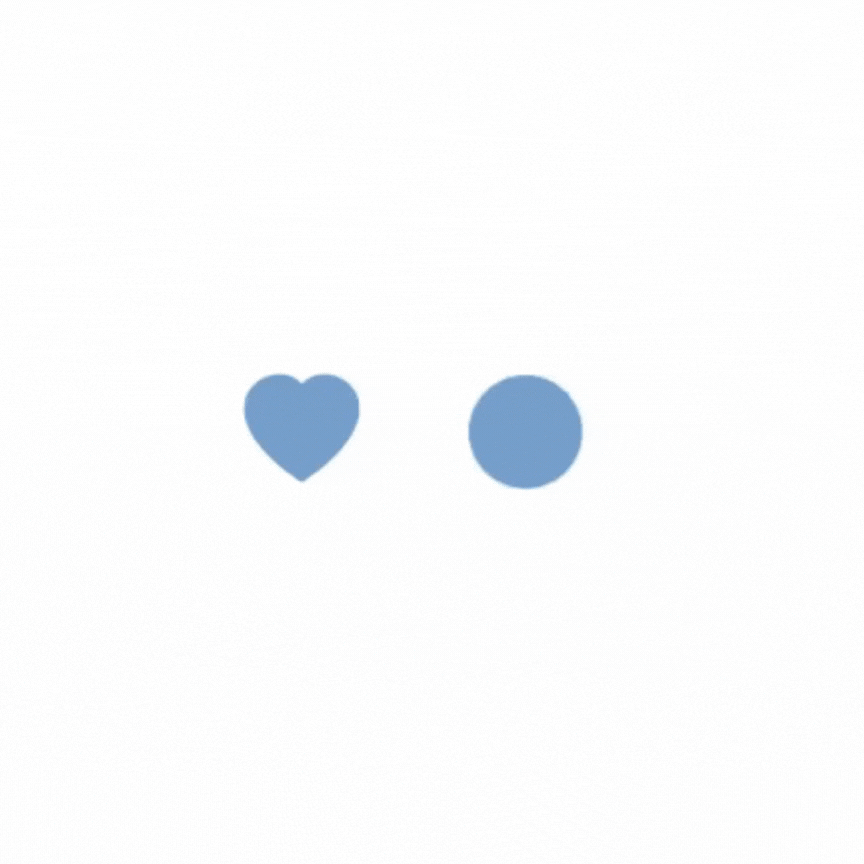
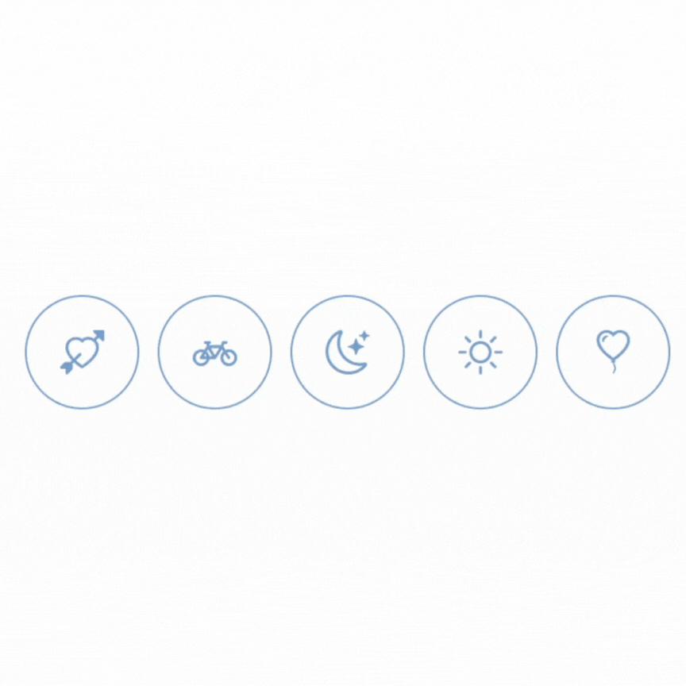
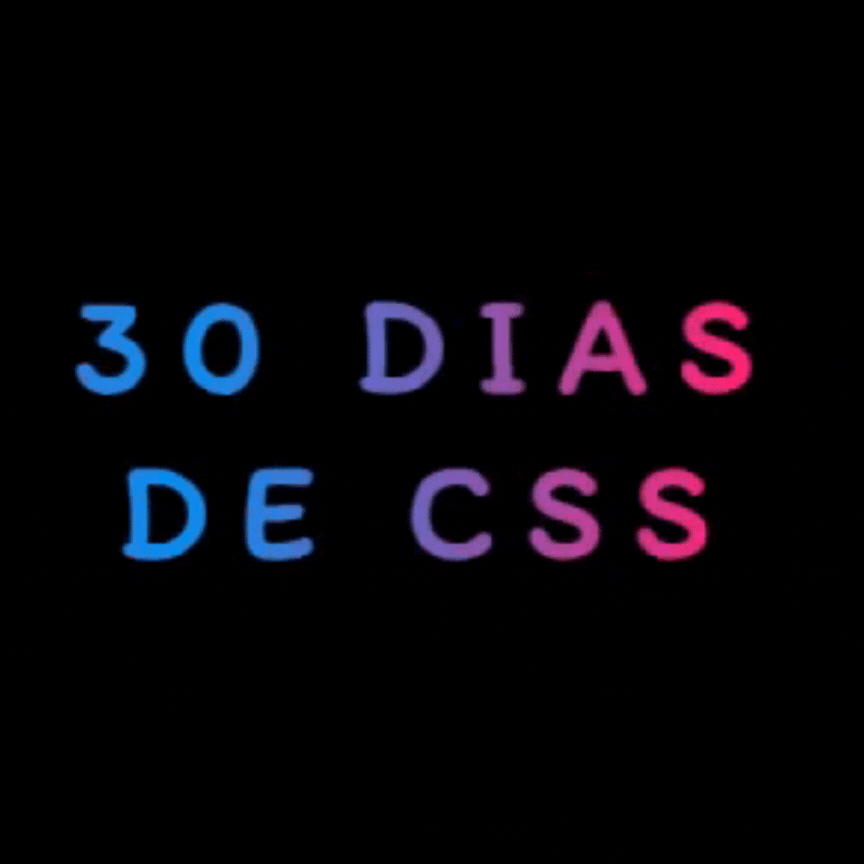
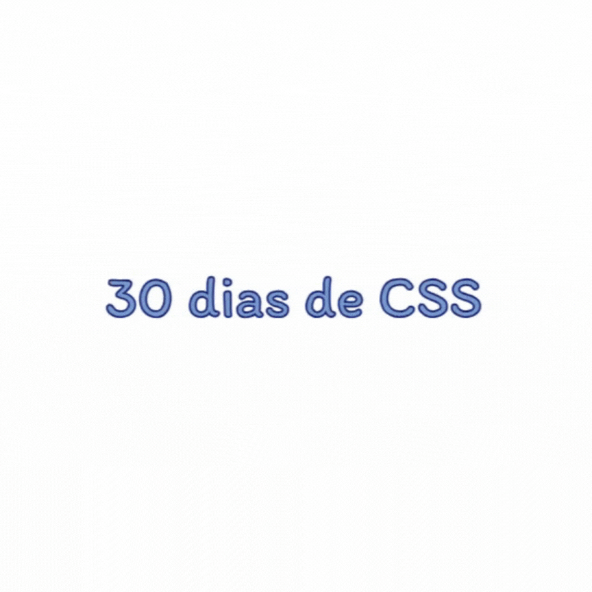

# 30 dias de CSS 🚀

Olá! 🖖 Estou começando o desafio 30 dias de CSS para praticar e adiquirir conhecimentos. Acompanhei o desafio no perfil do LinkedIn da Brenda Antunes e achei muito interessante. Acesse o [repositório da Brenda](https://github.com/Brenda-A-S/30-days-css).

Referências: [Online Tutorials](https://www.youtube.com/channel/UCbwXnUipZsLfUckBPsC7Jog), [Red Stapler](https://www.youtube.com/channel/UCRthRrv06q1iOl86-tTKJhg) e [Daily Tuition](https://www.youtube.com/channel/UCrG2Z0usOCCdUTAr4D1A8mw).

## Dia 1 - Ícone de mídia social em camadas

### O que aprendi e utilizei

* Camadas 
* Hover
* Nth-child
* Transcições
* Transform

## Dia 2 - Loader animado

### O que aprendi e utilizei

* CSS Animation
* CSS Transform
* CSS @keyframes

## Dia 3 - Mudança de cor

### O que aprendi e utilizei

* CSS Animation
* CSS Filter - Hue rotate
* CSS @keyframes

## Dia 4 - Botão com efeito

### O que aprendi e utilizei

* Before
* Hover
* Transições

## Dia 5 - Efeito pulsar

### O que aprendi e utilizei

* Animações CSS
* Transform

## Dia 6 - Efeito Texto brilhando

### O que aprendi e utilizei

* Animações CSS
* Nth-of-type
* Text-shadow

## Dia 7 - Texto esfumaçado

### O que aprendi e utilizei

* Filter blur
* Rotate e translate
* Transição e delay

## Dia 9 - Pendulo de Newton

### O que aprendi e utilizei

* Animação CSS
* Before
* Fist-child
* Last-child

## Dia 10 - Efeito máquina de escrever

### O que aprendi e utilizei

* Animação CSS
* Overflow
* white-space

## Dia 11 - Ícones com efeito

### O que aprendi e utilizei

* After/before
* Animação CSS
* Hover

## Dia 12 - Card com animação flip

### O que aprendi e utilizei

* Backface-visibility
* Perspective
* Transform rotateY
* Z-index

## Dia 13 - Checkbox de coração

### O que aprendi e utilizei

* After e before
* Input:checked
* Radial gradient
* Transform translate

## Dia 14 - Texto com gradiente animado

### O que aprendi e utilizei

* Animação CSS
* Background-clip
* Linear-gradient
* Text fill color

## Dia 15 - Menu com efeito hover

### O que aprendi e utilizei

* After e before
* Hover
* Transform scale
* Transition

## Dia 16 - Galeria com hover

### O que aprendi e utilizei

* Filter
* Hover
* Object-fit
* Overflow hidden
* Position relative e absolute
* Transition

## Dia 17 - Card com efeito de livro

### O que aprendi e utilizei

* Hover
* Perspective
* Transform rotateY
* transform origin

## Dia 18 - Efeito de preenhimento com hover

### O que aprendi e utilizei

* Before
* Hover
* Overflow hidden
* Transotions
* Webkit text stroke